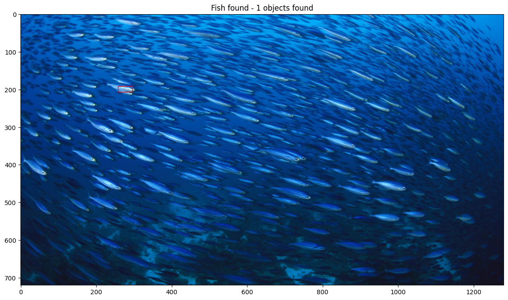
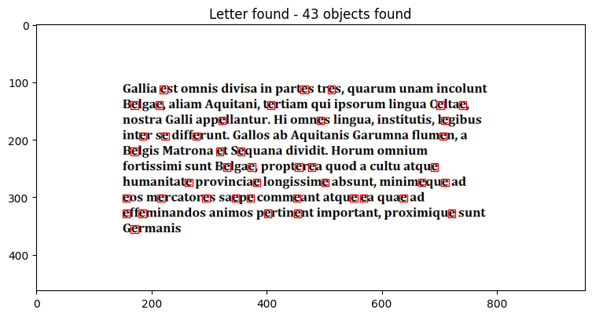

# OCR_and_Pattern_Matching
The showcase a method for OCR and Pattern Recognition using Fast Fourier Transform.

Below are examples of program results, a detailed description of operation, visualizations and implementation in `.ipnyb` files

# Pattern Recognition

# OCR

